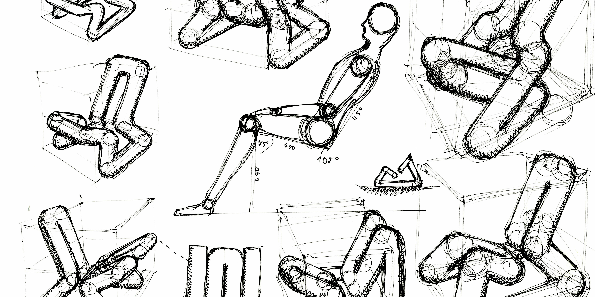
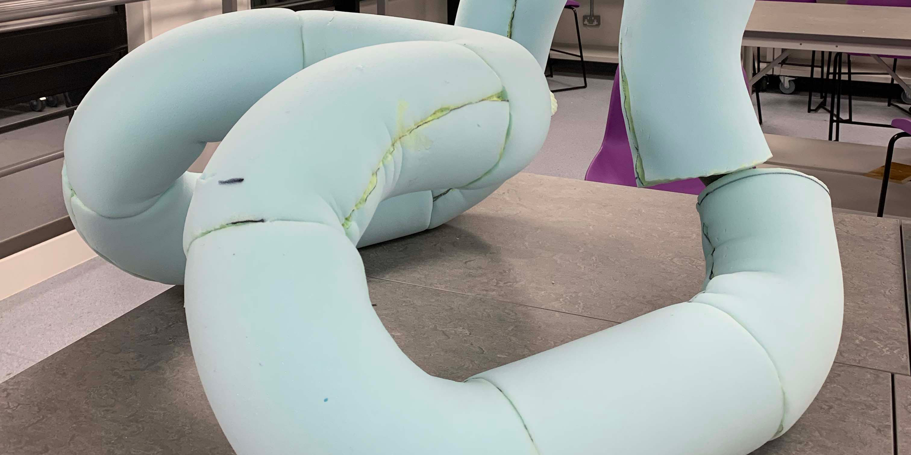
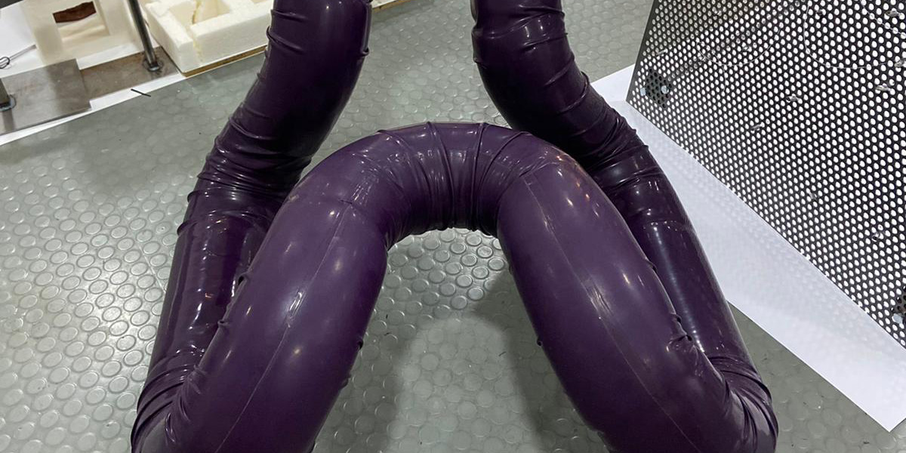
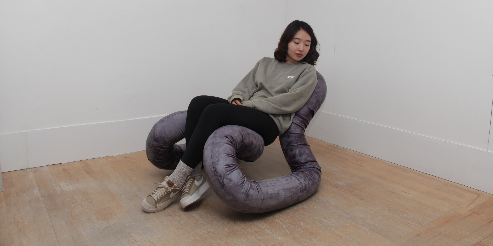

  

    
  

  

    
  

  
  

    
  

    
  

    
  

  
  

    
  

  <a class="prev" onclick="plusSlides(-1)">&#10094;</a>
  <a class="next" onclick="plusSlides(1)">&#10095;</a>

  •
  •
  •
  •
  •

